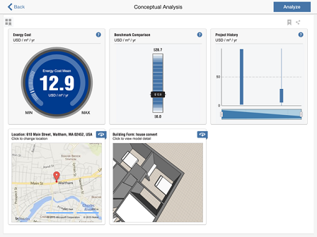

# Energieanalyse des gesamten Gebäudes

---

Sie können Faktoren auswerten, die sich auf die Gebäudenutzbarkeit auswirken, z. B. Wanddämmung und Effizienz der Lüftung.

Nur Autodesk FormIt 360 Pro

Die Energieanalysefunktion in FormIt 360 Pro ermöglicht einen besseren Einblick in die Effizienz Ihres Entwurfs anhand einer Reihe von Faktoren. Hierfür müssen Sie als Erstes den Standort Ihres Projekts festlegen, und es muss mindestens ein Körperobjekt vorhanden sein, auf das Ebenen angewendet wurden. Tippen Sie auf die Schaltfläche Energieanalyse , um den Befehls-Navigator für die Energieanalyse zu öffnen.

Bevor Sie Ihr eigenes Modell analysieren, können Sie das Gebäudeform-Widget öffnen und 13 zuvor modellierte Formen überprüfen. Um die Effizienz dieser Formen am aktuellen Standort des Projekts anzuzeigen, tippen Sie auf eine Form und dann auf das X-Symbol, um dieses Fenster zu schließen.

Damit wird im Befehls-Navigator für die Energieanalyse eine Reihe von Widgets für verschiedene Faktoren angezeigt.

Wenn Sie ein Widget für einen Faktor öffnen, können Sie seine Werte ändern, um festzustellen, wie sich dies auf den Mittelwert der Energiekosten auswirkt.

