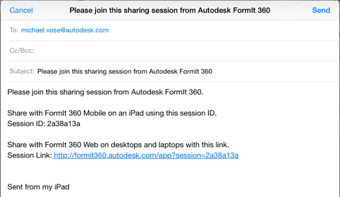

# Teilnahme an einer Sitzung

---

Nehmen Sie an der Zusammenarbeit teil.

* Melden Sie sich bei [Autodesk 360](https://360.autodesk.com) an.
* Klicken Sie auf den Link, den der Sitzungs-Host Ihnen geschickt hat, oder fügen Sie die URL des Links in die Adressleiste Ihres Browsers ein.

* Kopieren Sie die Sitzungs-ID und fügen Sie sie in das Feld Sitzung für Zusammenarbeit beitreten ein.

Sie werden als Teamkollege hinzugefügt und Ihr Symbol wird im Werkzeugkasten angezeigt. Tippen Sie auf das rote Kamerasymbol neben dem Namen eines Teamkollegen, um dessen Sitzungskamera zu folgen.

* Wenn Sie mit der Zusammenarbeit fertig sind, tippen Sie auf Gemeinsame Sitzung beenden.

Beachten Sie: Wenn Sie als Gastteilnehmer eine Sitzung verlassen, wird keine Kopie der Skizze in Ihrem A360-Konto gespeichert.

