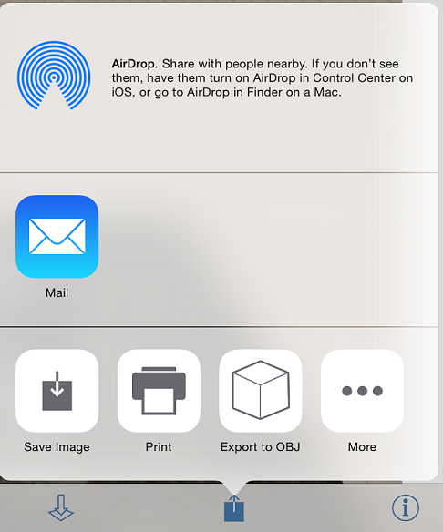

# Zusammenarbeit

---

Sie können gleichzeitig mit anderen Benutzern an derselben Skizze arbeiten oder Ihre Arbeit später freigeben. Anmerkung: Sie benötigen ein kostenloses [Autodesk 360](https://360.autodesk.com)-Konto, um die Funktionen für die Zusammenarbeit zu nutzen.

* Über die Palette Zusammenarbeit können Sie freigegebene Sitzungen starten und verwalten.

* Sie können eine Sitzung für die Zusammenarbeit starten und anderen Ihren Entwurf und die von Ihnen vorgenommenen Änderungen zeigen.

Außer über die gleichzeitige Zusammenarbeit in freigegebenen Sitzungen können Sie die von Ihnen erstellten Arbeiten auch auf andere Weise weitergeben. Ob Sie Bilder Ihres Entwurfs per E-Mail senden oder Ihre Skizzen für die Verwendung in anderen Programmen exportieren: Es ist einfach, Ihre Arbeiten zur Prüfung an andere Benutzer weiterzuleiten.

* Auf die Freigabeoptionen können Sie über das Symbol Export in der Aktionsleiste zugreifen. Sie können Ihre Arbeit wie folgt freigeben:

* Exportieren/Speichern als OBJ-Datei: Wenn Sie Ihre Arbeit in einem anderen Programm öffnen möchten, exportieren Sie eine OBJ-Datei, die automatisch als ZIP-Datei in Ihrem FormIt 360-Ordner auf Autodesk 360 gespeichert wird.
* E-Mail: Wenn Sie die Option E-Mail wählen, können Sie einen aktuellen Snapshot Ihrer Arbeit über Ihren E-Mail-Provider versenden.
* AirDrop: Mit AirDrop können Sie die AXM-Datei mit Ihrer Arbeit über WiFi oder Bluetooth für in der Nähe befindliche Geräte freigeben.
* Drucken: Mit der Option zum Drucken senden Sie einen aktuellen Snapshot Ihrer Arbeit an einen AirPrint-Drucker in der Nähe.

#### Siehe auch

* [ Speichern Ihrer Arbeiten](../../Manage Your Data/Saving Your Work.md)

#### Themen in diesem Abschnitt

* [Starten und Beenden freigegebener Sitzungen](../Start and Stop Collaborative Sessions.md)

Laden Sie andere Benutzer zur Mitarbeit am selben Entwurfsprojekt ein.

* [Teilnahme an einer Sitzung](../Joining a Session.md)

Nehmen Sie an der Zusammenarbeit teil.

* [Chatten mit Teamkollegen ](../Chat with Collaborators.md)

Beteiligen Sie sich an Gesprächen, während Sie am Entwurf arbeiten.

