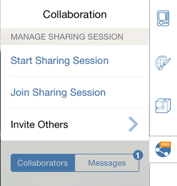
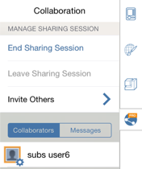

# Starten und Beenden freigegebener Sitzungen

---

Laden Sie andere Benutzer zur Mitarbeit am selben Entwurfsprojekt ein.

Geben Sie Ihre Arbeiten für Teamkollegen frei. Anmerkung: Dies steht nur für FormIt Pro zur Verfügung.

## Starten einer gemeinsamen Sitzung

* Klicken Sie auf das Symbol Zusammenarbeit ganz rechts im Werkzeugkasten. Wenn Sie sich noch nicht angemeldet haben, werden Sie aufgefordert, sich mit Ihrem [Autodesk 360](https://360.autodesk.com)-Konto anzumelden. Klicken Sie dann auf Gemeinsame Sitzung starten.

Ein Dialogfeld wird angezeigt, über das Sie andere Benutzer einladen können. Wenn Sie erfolgreich eine Sitzung gestartet haben, wird ein Symbol mit Ihrem Autodesk 360-Avatar auf der Registerkarte Zusammenarbeit angezeigt.

## Beenden einer Sitzung

* Wählen Sie auf der Registerkarte Zusammenarbeit Gemeinsame Sitzung beenden.

Gäste können gemeinsame Sitzungen nicht beenden.

