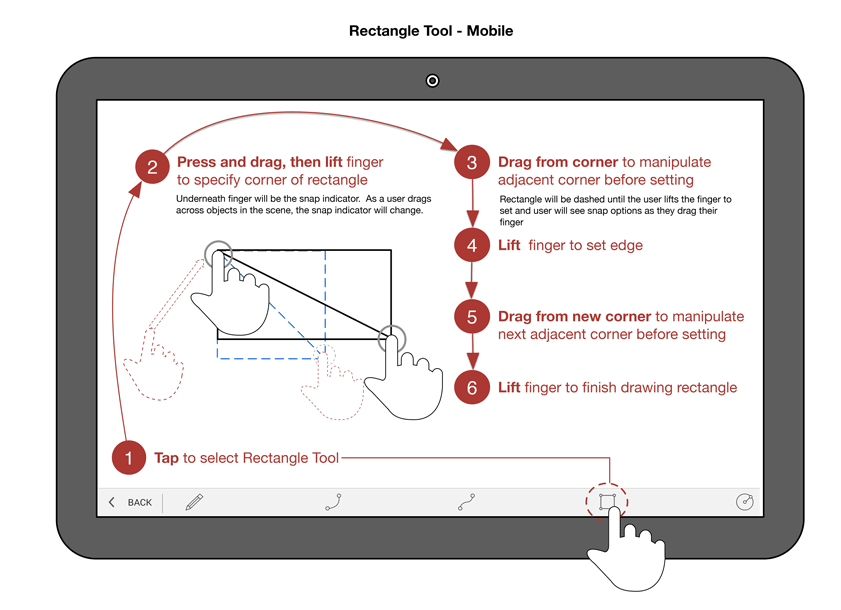

# Skizzieren von Formen

---

Erstellen Sie aus Linien, Bogen, Splines, Rechtecken und Kreisen Formen, die Sie zu Gebäudeentwürfen zusammenfügen können.

Nachdem Sie ein Zeichenwerkzeug ausgewählt haben, können Sie den Cursor an beliebiger Stelle im Zeichenbereich platzieren, um den Objektfang und Ableitungspunkte zu verwenden, bevor Sie den ersten Punkt festlegen.

## Verwenden von Linien

1. Nachdem Sie das Werkzeug Linie ausgewählt haben, können Sie auf eine beliebige Stelle im Zeichenbereich tippen und durch Ziehen mit dem Finger den Objektfang und Ableitungspunkte verwenden. Um den ersten Endpunkt der Linie zu platzieren, lassen Sie los. Um das nächste Liniensegment zu zeichnen, müssen Sie am vorherigen Endpunkt mit dem Ziehen beginnen.
## Verwendung von Bogen

1. Nachdem Sie das Werkzeug Bogen ausgewählt haben, können Sie auf eine beliebige Stelle im Zeichenbereich tippen und durch Ziehen mit dem Finger den Objektfang und Ableitungspunkte verwenden. Um den ersten Endpunkt des Bogens zu platzieren, lassen Sie los. Um den anderen Endpunkt des Bogens zu zeichnen, müssen Sie am vorherigen Endpunkt mit dem Ziehen beginnen. Ziehen Sie schließlich den Mittelpunkt, um den Winkel des Bogens zu steuern. 
## Verwendung von Splines

1. Nachdem Sie das Werkzeug Spline ausgewählt haben, können Sie auf eine beliebige Stelle im Zeichenbereich tippen und durch Ziehen mit dem Finger den Objektfang und Ableitungspunkte verwenden. Um den ersten Endpunkt des Splines zu platzieren, lassen Sie los. Um den nächsten Endpunkt zu zeichnen, müssen Sie am vorherigen Endpunkt mit dem Ziehen beginnen.
## Verwendung von Rechtecken

1. Nachdem Sie das Werkzeug Rechteck ausgewählt haben, können Sie auf eine beliebige Stelle im Zeichenbereich tippen und durch Ziehen mit dem Finger den Objektfang und Ableitungspunkte verwenden. Um den ersten Endpunkt des Rechtecks zu platzieren, lassen Sie los. Um die Seiten des Rechtecks zu zeichnen, müssen Sie jeweils am vorherigen Endpunkt mit dem Ziehen beginnen.
## Verwendung von Kreisen

1. Nachdem Sie das Werkzeug Kreis ausgewählt haben, können Sie auf eine beliebige Stelle im Zeichenbereich tippen und durch Ziehen mit dem Finger den Objektfang und Ableitungspunkte verwenden. Um den Mittelpunkt des Kreises zu platzieren, lassen Sie los. Um den Radius des Kreises anzugeben, müssen Sie am Mittelpunkt des Kreises mit dem Ziehen beginnen. 

