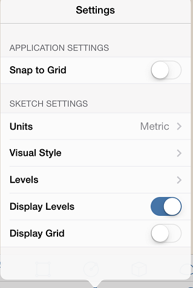

# Ebenen und Raumnutzung

---

Zeigen Sie Flächenberechnungen für Objekte in einem Entwurf an.

## Ebenen aktivieren

1. Tippen Sie auf das Symbol Einstellungen im unteren Werkzeugkasten.
2. Wählen Sie Ebenen, um die Höhe der einzelnen Ebenen anzugeben.

3. Geben Sie die Ebenen an, die den einzelnen Objekten in der Skizze zugewiesen werden sollen.

Mithilfe der Symbole + (Plus) und ++ (Doppel-Plus) können Sie Werte hinzufügen.

## Eigenschaften und Raumnutzung

Öffnen Sie in der Palette auf der rechten Seite die Registerkarte Eigenschaften, um die Eigenschaften ausgewählter Einzelobjekte in einer Skizze anzuzeigen oder zu bearbeiten. Unter Eigenschaften können Sie den Namen des Objekts bearbeiten, sein Volumen/seine Fläche anzeigen sowie zwischen Ebenen wechseln und sie bearbeiten.

* Während Sie Geometrie hinzufügen, werden die Angaben für Bruttofläche und Verhältnis Geschossdeckenfläche automatisch für die gesamte Skizze aktualisiert. Um diese Funktion zu aktivieren und diesen Zahlen weitere Angaben hinzuzufügen, müssen Sie die Option Fläche nach Ebene für jedes Objekt aktivieren.

