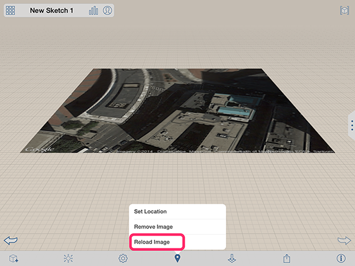

# Bearbeiten, Neuladen oder Entfernen eines Satellitenbilds

---

Sie können Änderungen an den Bildern für Ihren Standort vornehmen.

## Arbeiten mit Satellitenbildern

1. Um ein Satellitenbild erneut zu laden, wählen Sie in der Aktionsleiste das Standortsymbol  und dann Bild neu laden .
2. So entfernen Sie ein Satellitenbild
* Aktionsleiste: Wählen Sie im Werkzeugkasten unten das Standortsymbol und anschließend Bild entfernen .
* Kontextmenü: Tippen Sie zweimal, um das Satellitenbild auszuwählen. Bleiben Sie dann mit dem Finger auf dem Bild, um das Kontextmenü aufzurufen. 
* Wählen Sie das Symbol Löschen.

3. Wie bei anderen Bildern können Sie auch bei Satellitenbildern den Namen, die Transparenz und die vertikale Anordnung ändern.

