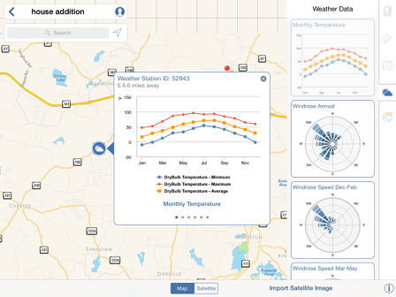

# Importieren eines Satellitenbilds

---

Gestalten Sie Ihren Entwurf detaillierter und wirklichkeitsgetreuer.

Satellitenbilder und Daten aus Wetterstationen ergänzen Ihre Entwürfe um wichtige Informationen.

#### Satellitenbild importieren

1. Geben Sie einen bestimmten Standort in das Suchfeld links oben unter dem Symbol Standort ein oder schwenken und zoomen Sie die Kartenansicht, um den Standort festzulegen.
2. Wenn Sie den Standort gefunden haben, halten Sie diese Stelle gedrückt, um den roten Pin zu setzen.
3. Tippen Sie auf Satellitenbild importieren, um der Skizze das Luftbild hinzuzufügen.
4. Verwenden Sie das daraufhin angezeigte Dialogfeld, um die Größe des Satellitenbilds anzupassen, sodass es den für Ihre Skizze relevanten Kontext zeigt.
5. Tippen Sie auf Bildimport fertig stellen.
#### Wetterstationen

1. Tippen Sie auf das Symbol einer Wetterstation in der Nähe des ausgewählten Standorts.

2. Die angezeigten Diagramme mit bisher gesammelten Daten zu Temperatur und Windrichtung an diesem Standort helfen Ihnen, fundierte Entscheidungen zur Ausrichtung des Gebäudes und für Körpermodelle unter Berücksichtigung der speziellen Klimaverhältnisse für Ihr Projekt zu treffen.

3. Durch Tippen auf das X in der rechten oberen Ecke schließen Sie die Anzeige der Wetterstation.

