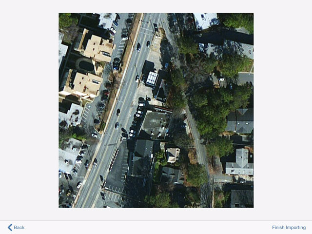

# Festlegen eines Standorts

---

Legen Sie den geografischen Standort für Ihre Skizze fest.

## Standort identifizieren

1.  Um den Standort für die Skizze festzulegen, tippen Sie in der Aktionsleiste unten auf das Symbol Standort. Sie können entweder über das Suchfenster nach einem bestimmten Standort suchen oder auf der Karte navigieren.

Wenn Sie das Suchfenster verwenden, können Sie den Standort aus der angezeigten Liste wählen.

1. Wenn Sie den Standort gefunden haben, passen Sie den Zoomfaktor an, um den gewünschten Kontext anzuzeigen.
2. Tippen Sie in die Karte, um den roten Pin am Standort zu setzen, falls er noch nicht vorhanden ist.
3. Tippen Sie auf Satellitenbild importieren, um das Luftbild für Ihren Standort anzuzeigen.

4. Vergrößern oder verkleinern Sie die Ansicht, um die gewünschte Ausrichtung zu erhalten.
5. Tippen Sie auf Bildimport fertig stellen, um den Vorgang abzuschließen.

