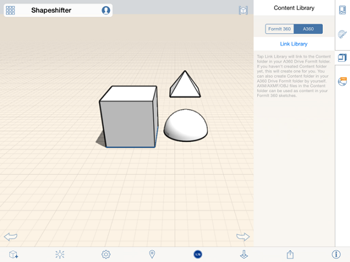

# Verknüpfen einer Inhaltsbibliothek

---

Zugriff auf zuvor gespeicherte Projekte und Grundstücksdateien.

1. Tippen Sie rechts neben dem Arbeitsbereich in der Eigenschaftenpalette auf das Symbol Inhaltsbibliothek.

2. Falls keine Inhalte angezeigt werden, tippen Sie auf die Schaltfläche Bibliothek verknüpfen.

3. Wählen Sie den Speicherort für Ihre Bibliothek, entweder auf Ihrem lokalen Laufwerk oder auf einem A360 Drive.

4. Navigieren Sie im Dialogfeld für die Dateinavigation zum Ordner auf oberster Ebene in Ihrer Inhaltsbibliothek.
5. Wählen Sie eine Inhaltsdatei aus.

