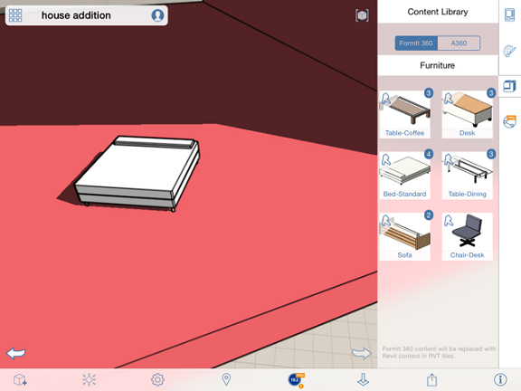

# Platzieren von Inhalten

---

Verwendung von Daten aus einer Inhaltsbibliotheksdatei in Entwürfen.

Anmerkung: Wenn Sie Ihre Bibliothek lokal verknüpft haben und anschließend eine neue FormIt 360-Internetsitzung starten, müssen Sie die Inhaltsbibliothek erneut verknüpfen.

1. Tippen Sie auf eine Miniaturansicht.
2. Ziehen Sie den Inhalt in den Arbeitsbereich und legen Sie ihn dort ab oder ziehen Sie die Miniaturansicht mit dem Finger in den Arbeitsbereich und tippen Sie erneut, um den Inhalt zu platzieren.

