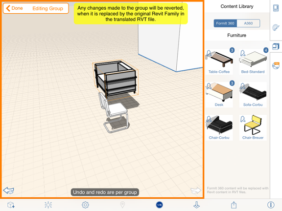

# Inhaltsbibliotheken

---

Verwenden Sie eine persönliche Bibliothek mit häufig verwendeten Elementen wie Möbeln, Gebäudeelementen oder Materialbasisdateien.

Sie können ältere Projekte und Grundstücksdateien speichern. Ihre Inhaltsbibliothek kann in einem lokalen Ordner (etwa einem Drop Box Sync-Ordner) oder in einem [Autodesk 360 Drive](https://360.autodesk.com) gespeichert und verknüpft werden. Um eine Inhaltsbibliothek zu verwenden, tippen Sie im Eigenschaftenbereich rechts neben dem Arbeitsbereich auf das Symbol Inhaltsbibliothek.

Nachdem Sie neue FormIt-Skizzen (AXM), OBJ- oder STL-Dateien in Ihre Inhaltsdateistruktur aufgenommen haben (lokal oder auf A360 Drive), müssen Sie die Inhaltsbibliothek in FormIt aktualisieren. Klicken Sie dazu erneut auf die Schaltfläche zum Verknüpfen der Bibliothek, und navigieren Sie entweder zu Ihrer lokalen Bibliothek, oder wählen Sie die A360-Option. FormIt aktualisiert daraufhin automatisch die Liste.

Wenn Sie Ihre Bibliothek lokal verknüpft haben und anschließend eine neue FormIt-Sitzung starten, müssen Sie die Inhaltsbibliothek erneut verknüpfen. Wenn Sie auf die Registerkarte Inhaltsbibliothek klicken, wird ein Dialogfeld angezeigt, in dem die Berechtigung zur Verknüpfung zu einem lokalen Ordner angefordert wird. Sie müssen zum Ordner auf der obersten Ebene Ihrer Inhaltsbibliothek navigieren.

Die Inhalte werden der Skizze als Gruppe hinzugefügt. Sie können mithilfe der Gruppenbearbeitungswerkzeuge Änderungen an diesen Inhalten vornehmen.

Im Gruppenbearbeitungsmodus werden der Name und die Kategorie des Inhalts angezeigt. Der Name und die Kategorie von Inhalten, die aus Revit-Familien konvertiert wurden (lokal oder auf A360), können nicht geändert werden.

Es ist möglich, die Geometrie platzierter Inhalte zu bearbeiten, diese Änderungen können jedoch nicht zurück in Revit migriert werden.

#### Themen in diesem Abschnitt

* [Verknüpfen einer Inhaltsbibliothek](../Link a Content Library.md)

Zugriff auf zuvor gespeicherte Projekte und Grundstücksdateien.

* [Platzieren von Inhalten ](../Place Content.md)

Verwendung von Daten aus einer Inhaltsbibliotheksdatei in Entwürfen.

