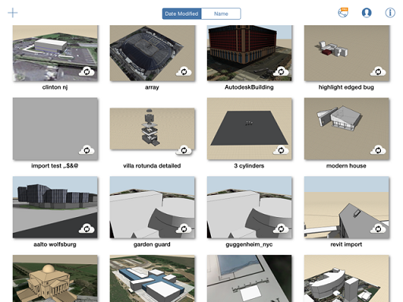

# Speichern der Änderungen

---

Ihre Entwürfe bleiben in unterschiedlichen Formaten unverändert erhalten.

* Sie können auf alle Ihre Skizzen über den Katalog Ihres Geräts  oder auf [http://360.autodesk.com](http://360.autodesk.com) zugreifen. Jedes Mal, wenn Sie das Programm beenden, speichert die Software automatisch die Skizze, an der Sie zuletzt gearbeitet haben. Jedes Mal, wenn Sie zum Katalog zurückzukehren, werden Sie aufgefordert, Ihre Skizze zu speichern. Melden Sie sich bei [http://360.autodesk.com](http://360.autodesk.com) an, um Ihre Dateien in der Cloud zu synchronisieren.

Beim Synchronisieren einer Skizze in [http://360.autodesk.com](http://360.autodesk.com) werden drei Dateien in den Formaten AXM, SAT und RVT (letztere zum Öffnen in auf Revit-Software basierenden Produkten) erstellt.  Die Revit-Datei kann lokal heruntergeladen und direkt in Revit geöffnet werden.

