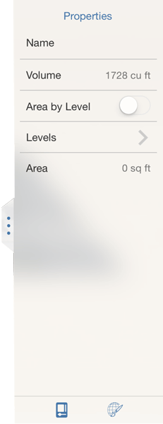

# Objekteigenschaften anzeigen

---

Zeigen Sie den Namen oder das Volumen/die Fläche sowie die Ebenenwerte eines Gebäudeobjekts an oder ändern Sie sie.

## Eigenschaften ändern und Raumaktualisierungen aktivieren

1. Um die Eigenschaften einzelner Objekte in einer Skizze zu bearbeiten, wählen Sie das ganze Objekt durch zweimaliges Tippen aus und öffnen Sie in der Palette an der rechten Seite die Registerkarte Objektegenschaften.
2. Sie können den Namen des Objekts bearbeiten, sein Volumen und seine Fläche anzeigen, die Flächenwerte der einzelnen Ebenen nacheinander anzeigen sowie Ebenenwerte hinzufügen oder bearbeiten.
3. Um automatisch die Bruttofläche und das Verhältnis der Geschossdeckenfläche für die gesamte Skizze zu aktualisieren, aktivieren Sie die Funktion Fläche nach Ebene für jedes Objekt.

