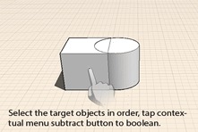

# Ändern: Boolesche Operationen

---

Bearbeiten Sie Objekte mithilfe der Operationen zum Verbinden und Schneiden.

1.  Verbinden: Wählen Sie alle Objekte aus, die Sie in die boolesche Verbindung aufnehmen möchten. Wählen Sie dann das Werkzeug Verbindung aus dem Kontextmenü. Der Bereich, in dem die Geometrie sich überschneidet/überlappt, wird innerhalb eines Objekts zusammengeführt.
2. Subtrahieren: Um Volumina von bestehender Geometrie zu subtrahieren, wählen Sie zunächst das Originalobjekt aus.
3. Wählen Sie anschließend das von diesem zu subtrahierende Objekt aus.
4. Wählen Sie dann das Subtraktionswerkzeug aus dem Kontextmenü.

Das Schnittvolumen wird vom Originalobjekt subtrahiert.

