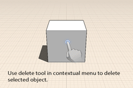

# Ändern: Löschen, Bearbeiten, Verschieben

---

Sie können Objekte entfernen, neu positionieren oder ihre Eigenschaften ändern.

1.  Um Geometrie zu löschen, müssen Sie sie zunächst auswählen. Öffnen Sie dann durch längeres Drücken das Kontextmenü und tippen Sie dort auf das Symbol Löschen.
2.  Um Kanten, Flächen oder Objekte zu verschieben, wählen Sie sie zunächst aus. Dadurch wird automatisch das Werkzeug Verschieben aktiviert. Setzen Sie den Cursor an die gewünschte Stelle, um Fang- und Ableitungspunkte für den Anfangspunkt der Verschiebung einzublenden, und tippen Sie, um zu beginnen. Setzen Sie jetzt den Cursor an die benötigte Stelle zur Anzeige von Fang- und Ableitungspunkten für die Zielposition der Verschiebung. Tippen Sie erneut, um das Objekt zu platzieren.

