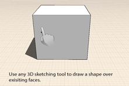
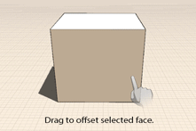

# Ändern: Extrudieren, Flächen ausschneiden/versetzen

---

Es ist möglich, Flächen zu verschieben oder zu ziehen, neue Formen auf bestehenden anzubringen oder neue Kanten mit einem Versatz von den bestehenden zu erstellen.

1. Um eine Fläche zu schieben oder zu ziehen, tippen Sie darauf und ziehen Sie sie mit einem oder zwei Fingern. Durch Ziehen mit einem Finger wird die Fläche extrudiert, mit zwei Fingern wird sie unter Beibehaltung der Originalkanten extrudiert. Die Fläche wird vorwärts und rückwärts verschoben und Sie können beim Ziehen andere Modellelemente als Referenzen für Objektfang und Ableitungen nutzen. Tippen Sie erneut, um die Verschiebung der Fläche zu beenden.
2.  Um Formen aufzuprägen, zeichnen Sie mithilfe eines 3D-Skizzierwerkzeugs Linien, Bogen, Splines, Rechtecke oder Kreise auf bestehende Flächen. Durch diese Aktion erstellen Sie neue Flächen, die Sie unabhängig von der Originalfläche schieben oder ziehen können.
3.  Um eine Fläche zu versetzen, wählen Sie diese zunächst aus und klicken Sie dann im Kontextmenü auf das Werkzeug Versetzen. Ziehen Sie dann über die Fläche, um eine gegenüber den ursprünglichen Kanten versetzte Gruppe von Kanten zu erstellen.

