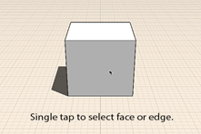

# Ändern: Kante/Fläche oder Objekt auswählen

---

Die Auswahl eines Objekts oder einer Oberfläche ist der erste Schritt bei der Bearbeitung.

1. Um eine Fläche, eine Kante oder einen Scheitelpunkt auszuwählen, zeigen Sie mit dem Cursor darauf und tippen Sie einmal.
2.  Durch Doppeltippen wählen Sie das gesamte Objekt aus.
3. Verwenden Sie das Lassowerkzeug, wenn Sie mehrere Geometrieobjekte mit größerer Präzision auswählen möchten. Es steht im Kontextmenü zur Verfügung, das Sie durch Tippen in den leeren Arbeitsbereich aufrufen. Zeichnen Sie dann eine Linie um den gewünschten Auswahlbereich.

