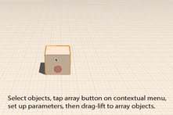

# Ändern: Neigen, Reihe, Kopieren/Einfügen

---

Erstellen Sie komplexere Entwürfe durch Änderungen an zuvor gezeichneten Formen.

## Ändern von Geometrie

Um komplexere Entwürfe zu erstellen, nachdem Sie eine Form skizziert oder einen Grundkörper eingefügt haben, können Sie die Geometrie mithilfe einer Reihe kontextabhängiger Werkzeuge bearbeiten. Zu diesen Operationen zählen: Neigen, Facettieren (nur Web), Kopieren/Einfügen und Reihe.

1. Um eine Fläche zu neigen, wählen Sie sie aus und halten Sie den Finger darauf, um das Kontextmenü anzuzeigen. Wählen Sie dann das Neigungssymbol aus dem Kontextmenü. Definieren Sie anschließend die Neigungsachse, indem Sie eine Linie zeichnen. Tippen Sie schließlich auf einen dritten Punkt, um die Fläche zu neigen.
2. Zum Kopieren und Einfügen von Flächen, Kanten oder Objekten wählen Sie diese zunächst aus, und wählen Sie dann das Symbol zum Kopieren aus dem Kontextmenü. Rufen Sie dann zum Einfügen das Kontextmenü erneut auf. Beim Einfügen stehen Optionen für Objektfang und abgeleitete Abhängigkeiten zur Verfügung. Durch Ziehen mit zwei Fingern erstellen Sie rasch eine Kopie eines Objekts.
3.  Um Reihen aus Kanten, Flächen oder ganzen Objekten zu erstellen, wählen Sie im Kontextmenü das Reihensymbol. Als Nächstes legen Sie die Reihenparameter fest. Tippen Sie dann ähnlich wie beim Werkzeug Verschieben auf das Objekt, um die Reihe zu beginnen, und tippen Sie erneut, um die Elemente der Reihe zu platzieren.

