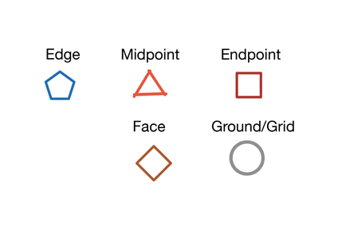
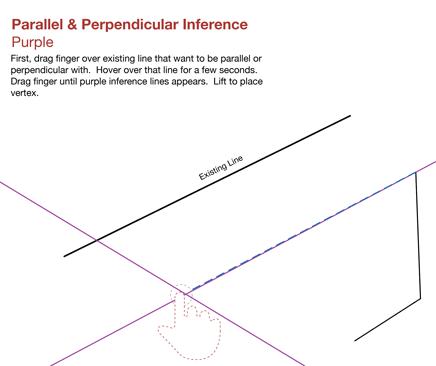
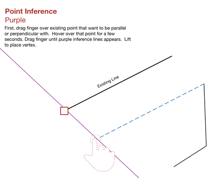

# Objektfang und Ableitungen

---

Diese integrierten Funktionen ermöglichen noch mehr Präzision beim Erstellen von Entwürfen.

* Objektfang und Ableitungspunkte ermöglichen eine präzise Erstellung, Platzierung und Bearbeitung von Geometrie und erleichtern dadurch das Skizzieren und Modellieren. Sie können die Achse wählen, entlang derer Sie zeichnen oder eine andere Funktion ausführen möchten, etwa das Extrudieren einer Oberfläche.

*Objektfang*

Beim Skizzieren und Modellieren stehen mehrere Objektfangfunktionen zur Verfügung. Der Objektfang für Objekte ist automatisch aktiviert. Die folgenden Fangreferenzen sind verfügbar:

* Kante
* Mittelpunkt
* Endpunkte (Scheitelpunkt)
* Fläche
* Zentrum auf Fläche
* Grundplatte

Damit Sie den Objektfang am Raster verwenden können, müssen Sie die Option Rasterfang aus dem Menü Einstellungen aktivieren.

*Ableitungspunkte*

Die automatische Auswahl für Ableitungspunkte ist immer aktiviert und unterstützt Sie dabei, die Bewegungsmöglichkeiten für Geometrie einzuschränken.

* Sie können Geometrie entlang der X-, Y- oder Z-Achse verschieben. Die Ableitung für die X-Achse ist rot, für die Y-Achse grün und für die Z-Achse blau.

* Es ist außerdem möglich, Geometrie parallel oder lotrecht zu vorhandenen Elementen zu verschieben. Parallele und lotrechte Ableitungen sind violett.

* Von einem Punkt ausgehend: Sie können auch von einer Punktreferenz ausgehende Ableitungen verwenden.

Von einem Punkt ausgehend: Sie können auch von einer Punktreferenz ausgehende Ableitungen verwenden. Setzen Sie den Cursor auf den Punkt, den Sie als Referenz verwenden möchten, bis die QuickInfo angezeigt wird, und verwenden Sie die von diesem Punkt ausgehende Ableitungsachse.

