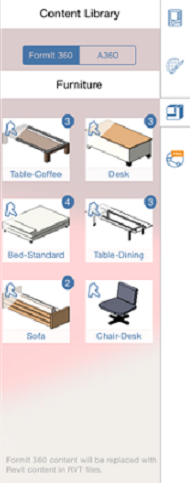

# Kontextmenü und Palette

---

Hier befinden sich die Werkzeuge zum Erstellen und Platzieren von Entwürfen.

Die Benutzeroberfläche der Software nutzt das Standardinteraktionsmodell der jeweiligen Plattform.

## Kontextmenü

* Um das Kontextmenü aufzurufen, drücken Sie längere Zeit auf ein Objekt oder eine leere Stelle. Entsprechend Ihrer Auswahl werden im Kontextmenü unterschiedliche Werkzeuge angezeigt, mit denen Sie die Auswahl bearbeiten können.

### Objekt-/Materialpalette

* Tippen Sie auf den Palettengriff oder streichen Sie von der Kante her, um die Objekt- bzw. Materialpalette zu öffnen. Auf der Registerkarte Objekteigenschaften können Sie Objektnamen verwalten, Ebeneneinstellungen definieren und Feedback zu Fläche und Volumen abrufen.

* Auf der Registerkarte Materialien können Sie Materialien erstellen, bearbeiten und auf Objekte anwenden.

* Verwenden Sie die Inhaltsbibliothek, um eine Bibliothek auf Ihrem lokalen Computer oder aus A360 Drive zu verknüpfen. Anschließend können Sie Inhalte aus der Bibliothek in Ihre FormIt 360-Skizze ziehen und ablegen.

