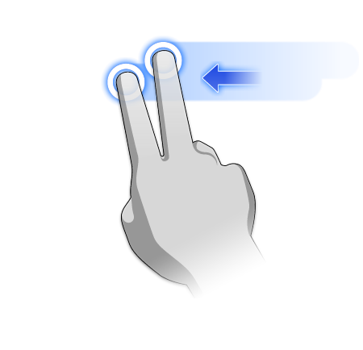
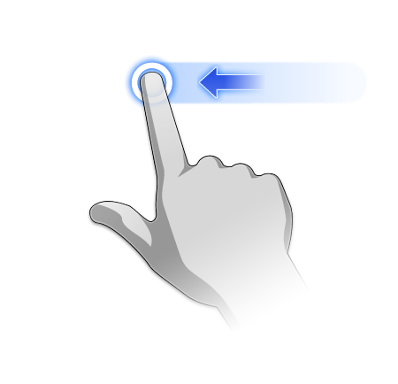
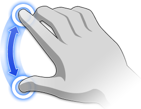

# Gesten

---

Diese Funktionen stehen für die Interaktion mit der Benutzeroberfläche zur Verfügung.

## Anleitung: Gesten und Interaktion

### Navigieren in der Ansicht

| | | |
| ---- | ---- | ---- |
| Schwenken|Ziehen mit zwei Fingern |  |
| Orbit | Ziehen mit einem Finger |  |
| Vergrößern/Verkleinern | Zusammenziehen und Dehnen | |
| An Fenstergröße anpassen | Zweimal tippen |  |

### Gesten zum Erstellen von Geometrie

| | | |
| ---- | ---- | ---- |
| 2D-Formen zeichnen | Tippen Sie auf eines der Werkzeuge Linie, Spline oder Rechteck und zeichnen Sie, indem Sie tippen, ziehen und loslassen. |  |
| Formen extrudieren | Tippen Sie, um eine Fläche auszuwählen, und ziehen Sie mit dem Finger nach oben oder unten. |  |
| Platzieren eines Grundkörpers | Tippen Sie in der Aktionsleiste auf den Grundkörper, und platzieren Sie das Objekt, indem Sie tippen, ziehen und loslassen. |  |

