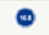

# Werkzeuge der Benutzeroberfläche

---

Referenz zu den Werkzeugen für Befehlsinteraktion.

* Skizze speichern: Tippen Sie hier, um die aktuelle Skizze zu speichern und zum Katalog zurückzukehren.
* Namen festlegen: Tippen Sie hier, um eine Tastatur aufzurufen und den Namen der Skizze zu ändern.
* Anmeldung bei Autodesk 360: Autodesk 360 Cloud-Services kostenlos zum Speichern und Freigeben Ihrer Skizzen.
* Im Menü Ansichtseinstellungen können Sie unter einer Reihe voreingestellter Ansichten wählen. Diese Ansichten ermöglichen eine rasche Visualisierung des Modells mit unterschiedlichen Perspektiven und Zoomfaktoren.

## Aktionsleiste

* Die Aktionsleiste befindet sich am unteren Rand des Bildschirms. Die Werkzeuge in der Aktionsleiste ermöglichen das Erstellen, Bearbeiten und Freigeben von Inhalten.

*  Geometrie erstellen: Tippen Sie hier, um ein Menü mit Erstellungswerkzeugen aufzurufen, mit deren Hilfe Sie Formen und Grundkörper zeichnen können.
* Beleuchtung und Schatten ändern: Mithilfe dieses Werkzeugs können Sie das Datum und die Uhrzeit ändern und Sonnenstudien starten (nur Pro).
* Standort festlegen: Sie können einen Standort suchen und Satellitenbilder in Ihre Skizze importieren. Weitere Informationen zum Festlegen des Standorts der Skizze finden Sie unter [Standort](../../Location/README.md).
* Energieanalyse: Ermöglicht die Durchführung des Energieverbrauchs Ihres Entwurfs.
*  Bilder und Modelle importieren: Sie möchten Inhalte importieren? Mithilfe dieses Werkzeugs können Sie Bilder und Modelle hinzufügen, die Sie in anderen Programmen erstellt haben.
* Arbeit freigeben: Möchten Sie Ihre Arbeit gemeinsam mit Teamkollegen nutzen? Sie können Ihre Skizze per E-Mail versenden oder Ihre Arbeit als AXM-Datei über AirDrop an Geräte in der Nähe übermitteln.
* Sie benötigen weitere Unterstützung? Mithilfe der Informationswerkzeuge lernen Sie FormIt noch besser kennen.

