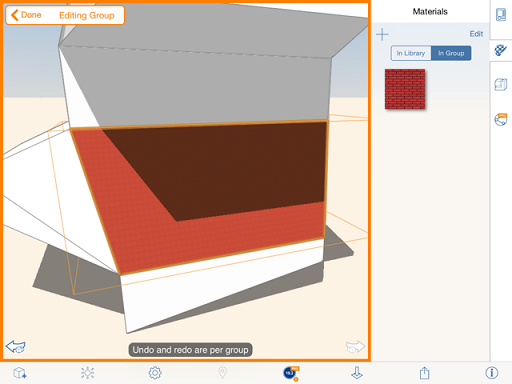

# Anwenden von Ebenen und Materialien auf eine Gruppe

---

Ein Verfahren zur gleichzeitigen Bearbeitung mehrerer Objekte

## Ebenen anwenden

1. Wählen Sie ein Objekt aus der Gruppe aus, wechseln Sie jedoch nicht in den Bearbeitungsmodus.
2. Öffnen Sie die Palette Eigenschaften.
3. Aktivieren Sie Fläche nach Ebene und wählen Sie Ebenen, um die Höhe für jede Ebene festzulegen.

## Anwenden eines Materials

1. Wählen Sie eine Gruppe aus, tippen Sie zweimal, um das Kontextmenü anzuzeigen, und tippen Sie auf Bearbeiten. 
2. Wählen Sie Objekte oder Flächen in der Gruppe.
3. Öffnen Sie die Palette auf der rechten Seite, und zeigen Sie die Registerkarte Materialien an.
4. Tippen Sie auf Materialien, und verwenden Sie ein Material aus der Bibliothek oder, sofern vorhanden, ein bereits für die Gruppe gewähltes Material.

5. Tippen Sie auf Fertig.

