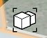

# Gruppieren von Objekten und Aufheben der Gruppierung

---

Durch Zusammenfassen von Geometrie in Gruppen ist sie leichter zu bearbeiten, sind Objekte klar voneinander zu unterscheiden und können Hierarchien zwischen Objekten erstellt werden.

#### Gruppieren von Objekten

1. Tippen Sie auf die Objekte, die Sie gruppieren möchten (Flächen oder Objekte).
2. Halten Sie eine Stelle in der Nähe der Objekte gedrückt, um das Kontextmenü anzuzeigen.
3. Tippen Sie auf das Symbol Gruppieren .
#### Aufheben der Gruppierung von Objekten

1. Um eine bestehende Gruppe ausgewählter Objekte aufzulösen, wählen Sie das Symbol Gruppierung aufheben. 

