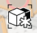

# Gruppe eindeutig machen

---

Kopieren einer Gruppe von Objekten und Lösen von den Originalen.

1. Tippen Sie auf eine Gruppe, um sie auszuwählen.
2. Zeigen Sie das Kontextmenü an, und tippen Sie auf das Symbol Als eindeutig definieren. 

