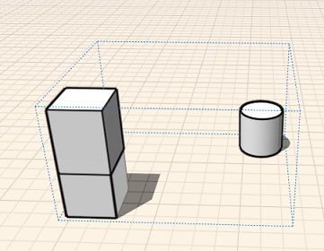

# Verwenden von Gruppen

---

Sie können ein oder mehrere Objekte zu Gruppen zusammenfassen, die sich leicht bearbeiten lassen.

Gruppen ermöglichen eine effizientere Erstellung von Geometrie.

* Nachdem Sie durch Platzieren von Grundkörpern oder Skizzieren von Formen Objekte erstellt haben, können Sie diese in Gruppen zusammenfassen, die jeweils als einzelnes wiederverwendbares Objekt behandelt werden. Durch Kopieren einer Gruppe erstellen Sie *Exemplare*. Solche Objekte sind miteinander verknüpft, d. h., Änderungen an einem Objekt bewirken die Aktualisierung auch der übrigen Objekte. Gruppen sind hilfreich beim Strukturieren von Skizzen und für die schnelle Aktualisierung ähnlicher Objekte.
* Die Werkzeuge für die Gruppierung sind über einen Werkzeugkasten problemlos zugänglich: Gruppe, Gruppierung aufheben, Als eindeutig definieren und Bearbeiten. (Diese Befehle sind auch im Kontextmenü enthalten.) Bei den Werkzeugen im Werkzeugkasten wählen Sie zuerst die Aktion und danach das Objekt, auf das diese angewendet werden soll. Beim Kontextmenü gehen Sie in umgekehrter Reihenfolge vor (was einen zusätzlichen Mausklick erforderlich macht): Sie wählen zuerst ein Objekt und dann die für dieses Objekt auszuführende Aktion. Aufgrund dieser Abfolge von Aktion und Auswahl ist der Werkzeugkasten für die Bearbeitung verschachtelter Gruppen besser geeignet. Sie können auch Tastaturbefehle verwenden: G, E, F (Gruppe, Bearbeiten, Fertig stellen) sowie U (Gruppierung aufheben) und M (Als eindeutig definieren).

 

Nur bestimmte Elemente eines Objekts können gruppiert werden: ein ganzes Objekt, eine Fläche und eine unabhängige Kante. Scheitelpunkte und zu anderen Elementen gehörige Kanten können nicht gruppiert werden.

#### Themen in diesem Abschnitt

* [Gruppieren von Objekten und Aufheben der Gruppierung](../Group-Ungroup Objects.md)

Durch Zusammenfassen von Geometrie in Gruppen ist sie leichter zu bearbeiten, sind Objekte klar voneinander zu unterscheiden und können Hierarchien zwischen Objekten erstellt werden.

* [Gruppe bearbeiten](../Edit Group.md)

Aktualisieren oder Ändern einer vorhandenen Gruppe.

* [Verschachteln von Gruppen](../Nest Groups.md)

Fassen Sie ähnliche Elemente in einem Entwurf zusammen.

* [Skalieren von Gruppen](../Scale a Group.md)

Skalieren eines Gruppenexemplars unter Beibehaltung der Beziehung zu anderen Exemplaren.

* [Gruppe eindeutig machen](../Make Group Unique.md)

Kopieren einer Gruppe von Objekten und Lösen von den Originalen.

* [Anwenden von Ebenen und Materialien auf eine Gruppe](../Apply Levels and Materials to a Group.md)

Ein Verfahren zur gleichzeitigen Bearbeitung mehrerer Objekte

* [Gruppenachsen und Arbeitsebenen](../Group Axes and Work Planes.md)

