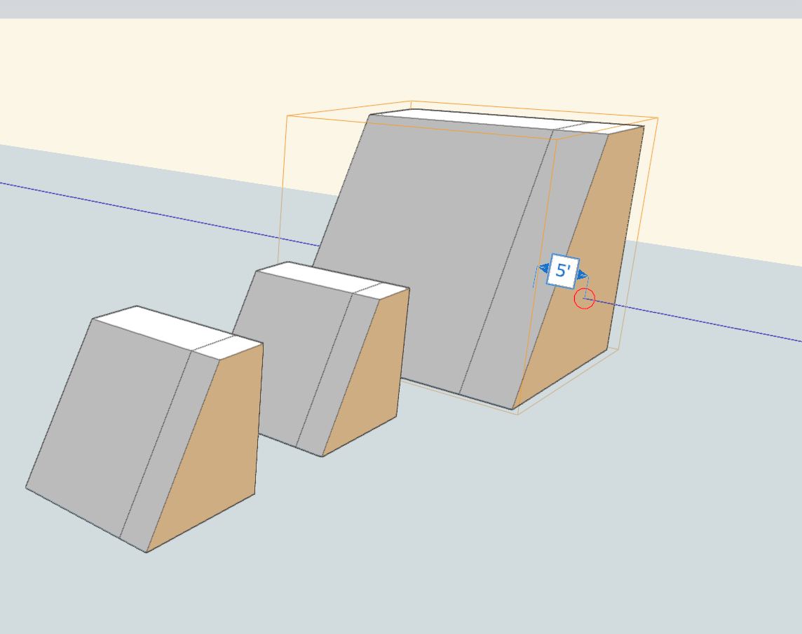

# Skalieren von Gruppen

---

Skalieren eines Gruppenexemplars unter Beibehaltung der Beziehung zu anderen Exemplaren.

Es ist möglich, ein Gruppenexemplar zu skalieren, wobei das Verhältnis zwischen den verschiedenen Gruppenexemplaren trotz unterschiedlicher Größe unverändert bleibt.

1. Wählen Sie ein Gruppenexemplar aus.
2. Tippen und halten Sie das Gruppenexemplar, um das Kontextmenü anzuzeigen, und tippen Sie auf die Schaltfläche Skalieren. 
3. Bearbeiten Sie das skalierte Gruppenexemplar, indem Sie zweimal darauf tippen. Beachten Sie, dass die anderen, kleineren Gruppenexemplare ebenfalls auf die Änderung reagieren.

