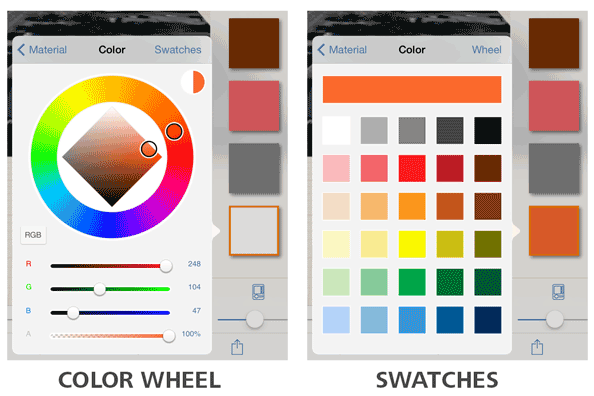
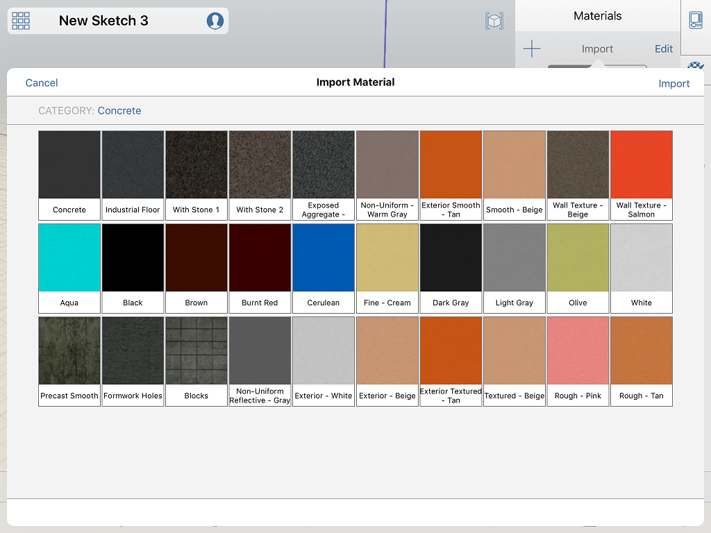

# Erstellen eines Materials

---

Verwenden Sie den Material-Editor zum Erstellen neuer Materialien für Ihre Szene.

Sie können eigene Materialien aus benutzerdefinierten Bitmap-Dateien erstellen.

### Erstellen eines Materials

1. Tippen Sie auf das Pluszeichen (+) in der Materialpalette.
2. Wählen Sie eine Bitmap für das Material.

Laden Sie ein Bild aus einer Datei, oder nehmen Sie mit dem Tablet ein Foto auf.

1. Wählen Sie eine Farbe für das Material. Falls eine Bitmap geladen ist, wird die Farbe mit dieser gemischt.

* Texturen werden aus der Filmrolle oder der Fotobibliothek importiert. Sie können das Mapping der importierten Textur mithilfe des Werkzeugs für den Materialzuschnitt bearbeiten. Durch Zuschneiden der Texturen können Sie den Maßstab der Kacheln in horizontaler und vertikaler Richtung in Metern oder Fuß definieren.

## Importieren eines Autodesk-Materials 

Wenn Sie das optionale [FormIt 360 Pro-Abonnement](http://www.autodesk.com/products/formit-360/try-buy) erworben haben, können Sie Materialien aus der Autodesk-Materialbibliothek importieren.

1. Klicken Sie in der Materialpalette auf Material importieren.
2. Suchen Sie unter Material importieren das gewünschte Material anhand seines Namens, um es für den Import in die Szene auszuwählen, und klicken Sie auf OK.
3. Das Material kann jetzt wie jedes andere Material angewendet oder [bearbeitet](../Edit a Material.md) werden.

