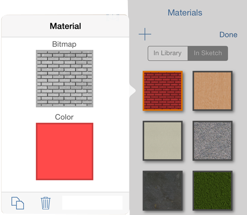

# Bearbeiten eines Materials

---

Der Material-Editor ermöglicht es Ihnen, Materialien genau nach Ihren Vorstellungen darzustellen.

Die Textur, die Farbe und andere Eigenschaften von Materialien können im Material-Editor bearbeitet werden.

## Bearbeiten eines Materials

1. Tippen Sie in der Materialpalette auf die Schaltfläche Bearbeiten.
2. Tippen Sie auf das Material, das Sie bearbeiten möchten.

3. 

4. Im Fenster Material bearbeiten können Sie die folgenden Eigenschaften ändern, wobei jeweils das Vorschaubild auf der rechten Seite aktualisiert wird.

* *Textur*: Texturen sind Bilder aus der Fotobibliothek oder Kamera. Nachdem Sie diese importiert haben, können Sie die Textur zuschneiden und ihren Maßstab in horizontaler und vertikaler Richtung ändern.
* *Farbe*: Bei Materialien, die sowohl Textur als auch Farbe aufweisen, werden beide miteinander multipliziert.

5. Klicken Sie auf OK, um die Änderungen am Material zu speichern.

