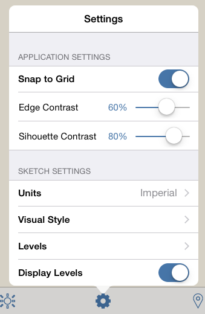

# Optionen für visuelle Formate

---

Beschreibung der Optionen für den Bildstil.

### Bildstiloptionen

| | |
| ---- | ---- |
|  |  * *Rasterfang*: Mit dieser Funktion aktivieren oder deaktivieren Sie den Rasterfang. * *Kantenkontrast:* Verstärken oder reduzieren Sie den Kontrast bei der Anzeige von Kanten. * *Silhouettenkontrast:* Verstärken oder reduzieren Sie den Kontrast bei der Anzeige von Silhouettenkanten. * *Einheiten*: Legen Sie hier die Einheiten für die Skizze fest: Britisch oder metrisch * *Bildstile:* Ändern Sie die Darstellung der Skizze durch Aktivieren oder Deaktivieren von Funktionen wie skizzenartigen Linien, verdeckten Linien oder verlängerten Linien.   * *Display sketchy lines*: Ändern Sie die Darstellung Ihrer Skizze durch Aktivieren oder Deaktivieren einer Liniendarstellung, die wie von Hand gezeichnet wirkt.   * *Show hidden lines*: Zeigt schwache Linien an Stellen an, die normalerweise durch andere Flächen verdeckt sind.  * **Dehnen von Linien*: *Zeigt kurze Verlängerungen an den Schnittpunkten von Linien an.  * *Dicke Kanten*: Die dicksten möglichen Linien.  * *Kanten ausblenden*: Durch Aktivieren bzw. Deaktivieren dieser Funktion blenden Sie Kanten im Modell ein bzw. aus. * *Ebenen*: Ändern Sie Ebenenhöhen für die gesamte Skizze (siehe Anwenden von Ebenen für weitere Informationen). * *Display levels: Blendet die Ebenen ein oder aus.  |
|  |  * *Display grid*: Blendet das Raster ein oder aus. * *Display axes*: Blendet die Achsen des Koordinatensystems ein oder aus. * *Display north arrow: *Blendet den Nordpfeil ein oder aus. * *Dichtheitsprobleme: *Wird beim 3D-Druck zur Sicherunger Integrität des Modells verwendet.  |

